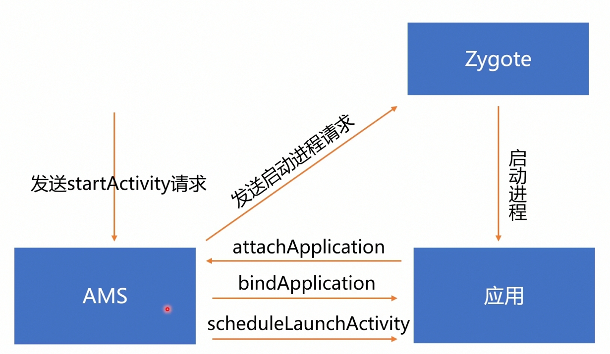

## 问题

1. Activity 启动生命周期回调
2. 启动涉及到的组件和通信过程
3. 生命周期回调原理

### 启动原理

1. startActivity  ---> 拿到AMS binder对象  ---> transact --->  AMS.onTransact()

2. AMS查询进程是否启动。 processRecord    -->进程启动流程参考 [进程启动](./应用进程启动.md)
3. mFocusedStack   --- > ActivityRecord  --> 
4. ProcessRecord.Thread.SheduleLaunchActivity 封装消息发送到主线程
5. 创建Activity 对象  --> 准备好 Application --->  创建ContextImpl    ---->

attach  Context  ---->  生命周期回调。

