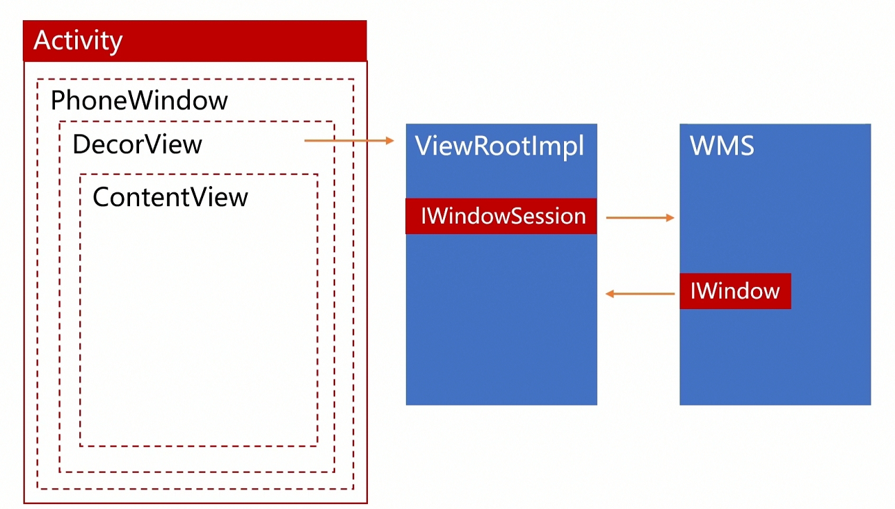

## 相关问题

Activity的显示原理  Window/DecorView/ViewRoot

Activity 的UI刷新机制   Vsync / Choreography

UI的绘制原理    Measure /Layout/ Draw

Surface原理    Surface/ SurfaceFlinger


## 问题描述

1. setContentView原理是什么    
2. Activity在OnResume 才显示原因什么？  
3. ViewRoot 是干什么的？   


### 原理讲解：





1.  setContentView()  

```java
//Activity.java
public void setContentView(@LayoutRes int layoutResID) {
        //getWindow 返回 PhoneWindow
        getWindow().setContentView(layoutResID); --->
        ..
}
```


2. attach  会调用创建PhoneWindow,用于管理手机窗口

```java
//PhoneWindow.java

public void setContentView(int layoutResID) {
        if (mContentParent == null) {
            //创建Decor View
            installDecor();
        } 
       // 加载布局，并解析 生成ViewTree
       mLayoutInflater.inflate(layoutResID, mContentParent); 
}
```


3. OnResume之后展示出来    

```java
//ActivityThread
public void handleResumeActivity(IBinder token, ..) {
        // TODO Push resumeArgs into the activity for consideration
    	// 调用Activity的 Resume 生命周期方法
        final ActivityClientRecord r = performResumeActivity(token, ..);
        View decor = r.window.getDecorView();
        decor.setVisibility(View.INVISIBLE);
        // *** 
        ViewRootImpl impl = decor.getViewRootImpl();
        ViewManager wm = a.getWindowManager();  ---->
        wm.addView(decor, l);
       // 进行一次重绘
       r.activity.makeVisible();
}
```

4.  windowManagerImpl.java

```java
//WindowManagerImpl  ---> WindowManagerGlobal.java
 public void addView(View view,..){
	ViewRootImpl root;
    root = new ViewRootImpl(view.getContext(), display);
    mViews.add(view);
    mRoots.add(root);
    root.setView(view, wparams, panelParentView);  ---->
 }

```

5.  ViewRootImpl.java

```java
public void setView(View view, ..) {
    // Schedule the first layout -before- adding to the window
    // manager, to make sure we do the relayout before receiving
    // any other events from the system.
    // 触发第一次绘制
    requestLayout();  
    //-->scheduleTraversals()
    // 加入到  Choreography  /ˌkɒriˈɒɡrəfi/  Vsync 到来时候会触发 界面刷新 
    //--> mChoreographer.postCallback(mTraversalRunnable) 
    // 申请Surface
    
    mWindowSession.addToDisplay(mWindow, mSeq,...);
    //mWindow 是->IWindow.Stub
    // mWindowSession 是 WMS 创建的通信句柄
    // WMS.addWindow( )  建立双向通信机制
}

```

WMS作用： 

1. 分配 Surface
2. 掌管Surface显示顺序及其位置尺寸等
3. 控制窗口动画
4. 输入事件分发


### 相关知识点 

为什么OnMeasure 会被多次调用？


//ViewRootImpl.java

```java
void scheduleTraversals() {
        if (!mTraversalScheduled) {
            //postSyncBarrier 设置消息屏障，后面的消息暂时不处理，仅处理异步消息
            
            mTraversalBarrier = mHandler.getLooper().getQueue().postSyncBarrier();
            mChoreographer.postCallback(
                    Choreographer.CALLBACK_TRAVERSAL, mTraversalRunnable, null);
            									// doTraversal()
            notifyRendererOfFramePending();
            pokeDrawLockIfNeeded();
        }
    }
// ||
// \/
private void performTraversals() {
	 // Ask host how big it wants to be
    performMeasure(childWidthMeasureSpec, childHeightMeasureSpec);

    // Implementation of weights from WindowManager.LayoutParams
    // We just grow the dimensions as needed and re-measure if
    // needs be
    int width = host.getMeasuredWidth();
    int height = host.getMeasuredHeight();
    boolean measureAgain = false;
	// 这里说明  子View区域超过了父View  会进行重新测量
    if (lp.horizontalWeight > 0.0f) {
        width += (int) ((mWidth - width) * lp.horizontalWeight);
        childWidthMeasureSpec = MeasureSpec.makeMeasureSpec(width,
                                                            MeasureSpec.EXACTLY);
        measureAgain = true;
    }
    if (lp.verticalWeight > 0.0f) {
        height += (int) ((mHeight - height) * lp.verticalWeight);
        childHeightMeasureSpec = MeasureSpec.makeMeasureSpec(height,
                                                             MeasureSpec.EXACTLY);
        measureAgain = true;
    }

    if (measureAgain) {
        if (DEBUG_LAYOUT) Log.v(mTag,
                                "And hey let's measure once more: width=" + width
                                + " height=" + height);
        performMeasure(childWidthMeasureSpec, childHeightMeasureSpec);
    }
}
```


