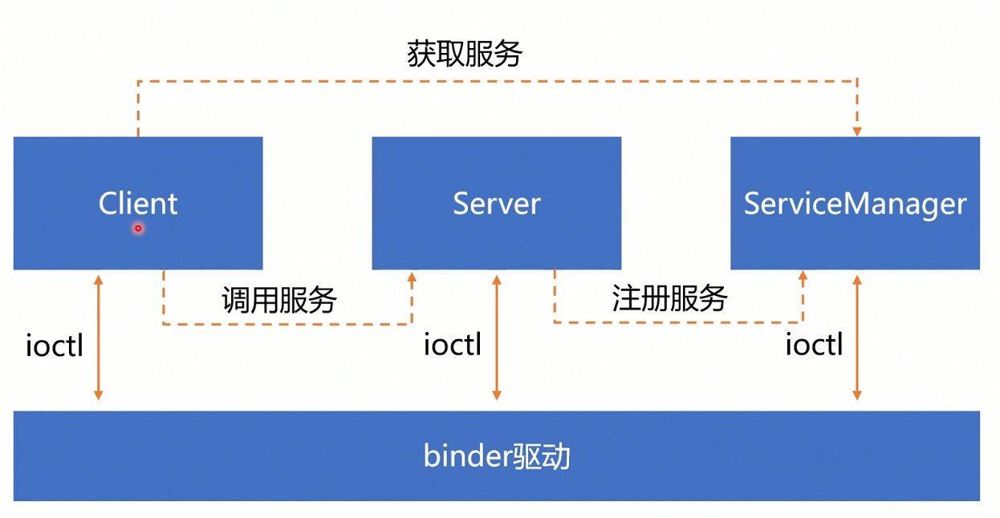
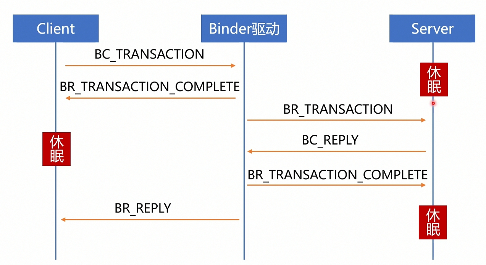
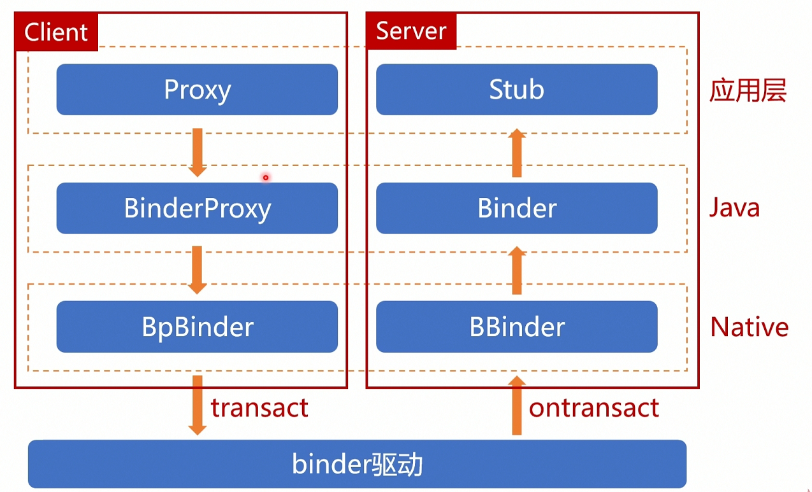

# 一、Android 启动的服务

1. 干了什么事情？
2. 有哪些主要服务？
3. 都是干什么的？


## 1. Zygote

1. Zygote有什么作用？   孵化应用进程、启动SystemServer
2. 启动过程是怎么样的 ？

C++ --> Java 

创建虚拟机-- 初始化JNI---跳转JAVA  

-->  加载初始化资源---> 启动SystemServer --> 进入Loop循环 socket 等待消息处理


3. Zygote 是怎么孵化进程的？
4. Zygote 是怎么启动SystemServer的 

ZygoteInit --> forkSystemServer()

​           -> Zygote.forkSystemServer()

​           -->com_android_internal_os_Zygote_nativeForkSystemServer()  ---> fork()


linux 进程启动方式：

```java
if(pid == fork() < 0){
    //error
} else if (pid == 0) {
    //child Process
    execve()  
        //--> 调用则独立资源
        // 不调用则共享 父进程资源
} else {
    // parent process
}
```


和U-Boot的异同

| 项目       | Zygote                                                       | U-Boot                                                       |
| ---------- | ------------------------------------------------------------ | ------------------------------------------------------------ |
| 跨语言启动 | C++   -->  JAVA                                              | 汇编 --> C                                                   |
| 第一阶段   | 1. 初始化JVM环境 <br />2. 初始化JNI<br />3. 跳转JAVA入口     | 1. 初始化硬件和SDRAM<br />2. 将C程序拷贝到内存<br />3. 跳转到C入口 |
| 第二阶段   | 1. 初始化资源，主题等<br />2. 启动关键服务<br />3. 进入Loop循环等待用户交互 | 1. 初始化Flash、开始终端打印、网卡<br />2. 跳转到初始化入口-->执行Init进程、initrc<br />3. 进入Loop循环 |


总结：

1.  Android启动阶段 分为了多个语言 阶段   汇编 -> C  /  C++ -->JAVA
2.  跨语言启动过程都进行了下一个阶段的初始化工作，并跳转到第二阶段入口
3.  一个存活的服务都需要在启动服务后进入Loop循环，等待被通信操作


## 2. SystemServer

1.  SystemServer 是怎么启动的？
2.  启动干了什么事情呢？

 Zygote.forkSystemServer(）

创建Systemserver进程  --->  处理启动细节  handleSystemServerProcess、


//ZygoteInit.zygoteInit()

1. RuntimeInit.commonInit();       常规初始化、 解析配置参数、类加载等

   // AndroidRuntime.cpp

2. ZygoteInit.nativeZygoteInit();     初始化Binder  

   // RuntimeInit.java

3. RuntimeInit.applicationInit(classloader)      跳转到SystemServer java入口main函数

// SystemServer.java 服务启动

1. 准备MainLooper
2. 创建 SystemServerManager  用于管理 后续创建的服务     用到类加载机制和反射
3. 分阶段启动服务， 分别有 bootstrapServices、CoreServices、OtherServices    PID < 1000
4. 进入 Loop 循环


## 3. ServiceManager

init.rc -->   start ServiceManager

1. 打开/dev/binder文件：open(“/dev/binder”, O_RDWR);
2. 建立128K内存映射：mmap(NULL, mapsize, PROT_READ, MAP_PRIVATE, bs->fd, 0);
3. *通知Binder驱动将自身注册为ServiceManager：binder_become_context_manager(bs);
4. 进入循环等待请求的到来：binder_loop(bs, svcmgr_handler);
   


服务的发布：

发布到ServicesManager: 

ServiceManager.addService("package", m);  --  >

getIServiceManager().addService(name, service, allowIsolated, dumpPriority)


## 4. AMS启动


SystemServer -- > startBootstrapServices() 

```java
public static ActivityManagerService startService(
                SystemServiceManager ssm, ActivityTaskManagerService atm) {
            sAtm = atm;
            return ssm.startService(ActivityManagerService.Lifecycle.class).getService();
}
```


1. 初始化资源 ， 包括了AMS 线程HandlerThread   添加异常处理机制 WatchDog

2. AMS - > start()  ,进行组件管理的必要初始化

   

3. AMS->setSystemProcess()      发布到 ServiceManager

   ```java
   ServiceManager.addService(Context.ACTIVITY_SERVICE, this, /* allowIsolated= */ true,
                       DUMP_FLAG_PRIORITY_CRITICAL | DUMP_FLAG_PRIORITY_NORMAL | DUMP_FLAG_PROTO);
   ```

   

4.  启动Launcher/ systemUI  
     //AMS -> systemReady() -- > 

    ComponentName cName = new ComponentName(mContext, SystemUserHomeActivity.class);

   

   


# 二、 Android 通信和网络通信对比


## 1. 通信方式


### 路由器示意图

****


1.  访问外部服务器，经过路由网络，找到下一跳服务器地址
2.  多级路由中保存了可达地址路由表
3.  查询路由表后， 将数据报文转发出去


### ServiceManager




1. 服务端启动服务，向ServiceManager 发布注册消息，并保存
2. 客户端 获取ServiceManager， 默认地址是0
3. 在ServiceManager中获取已注册发布的服务
4.  获取Service代理对象，完成通信


## 2. 通信协议

### TCP 通信协议：


### Binder通信协议：




总结：

使用可靠的通信传输协议，保证消息的准确可达。


## 3. 软件层次

### 网络传输模型


### Binder通信传输过程




# 三、Android 其他IPC通信机制


## 1. 管道

1. 半双工的通信方式，若想实现全双工，则需要一对描述符。pipe(fds)
2. 一般在父子进程使用
3. 数据量小的跨进程通信

两次拷贝

使用到管道的组件：

Looper


## 2. Socket

1. 全双工，可读可写
2. 在两个无亲缘关系的两个进程之间
3. 传输数据流不能太大 

两次拷贝


使用Socket的组件

Zygote   --> AMS 通信

## 


## 3. 共享内存

1. 快  不需要多次拷贝
2. 进程之间无需亲缘关系
3. 数据流较大的传输


使用共享内存地方：

MemoryFile -> SharedMemory

创建文件描述符  --> 申请内存空间  -->  Map 拷贝


图片传输相关


## 4. 信号

1. 单向， 无确认机制
2. 只能发信号，不能传参数
3. 只需知道PID即可发信号，可群发信号。 
4. Root权限，或UID相同可发信号


信号的使用：

杀进程：

```java
  public static final void killProcess(int pid) {
        sendSignal(pid, SIGNAL_KILL);
  }
```

Zygote  关注子进程退出流程：

```c++
static void SetSignalHandlers() {
  struct sigaction sig_chld = {};
  sig_chld.sa_handler = SigChldHandler;

  if (sigaction(SIGCHLD, &sig_chld, nullptr) < 0) {
    ALOGW("Error setting SIGCHLD handler: %s", strerror(errno));
  }

  struct sigaction sig_hup = {};
  sig_hup.sa_handler = SIG_IGN;
  if (sigaction(SIGHUP, &sig_hup, nullptr) < 0) {
    ALOGW("Error setting SIGHUP handler: %s", strerror(errno));
  }
}
```


