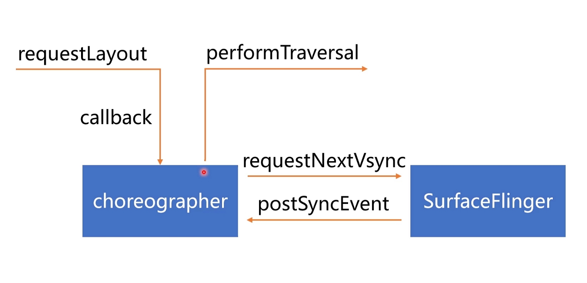
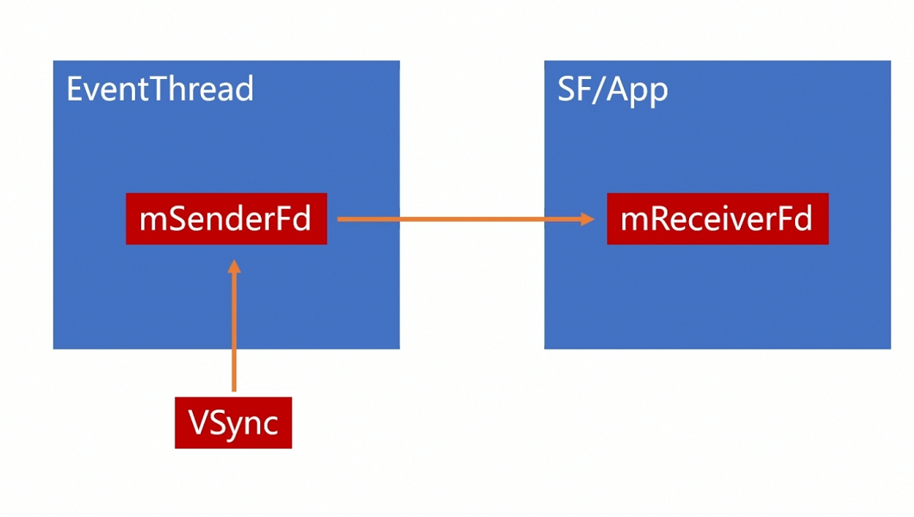

## 关键点:

Vsync 的原理？

Choreography的原理？

UI刷新的大致流程，应用和SurfaceFlinger的通信过程？





### UI绘制流程

1. requestLayout 重绘制
2. 创建了一个Callback 的traversal 的 Runnable。并增加了一个消息屏障
3. Choreography  向surfaceFlinger请求Vsync信号
4. Vsync 来的之后  会通过PostSyncEvent 回调给choreography
5. choreography -- >performTraversal


// DisplayEventReceriver.java


## Vsync机制

1. Vsync生成机制
2. Vsync在SurfaceFlinger中的分发流程
3. Vsync信号的分发原理


//SurfaceFlinger.cpp --> init()

// HWComposer

//DispSyncSource

// EventThread.cpp  ---> threadMain

//DisplayEventReceiver --> sendEvents -->fd


```java
//MessageQueue  使用管道文件描述符
void MessageQueue::setEventThread(android::EventThread* eventThread,
                                  ResyncCallback resyncCallback) {
    if (mEventThread == eventThread) {
        return;
    }

    if (mEventTube.getFd() >= 0) {
        mLooper->removeFd(mEventTube.getFd());
    }

    mEventThread = eventThread;
    mEvents = eventThread->createEventConnection(std::move(resyncCallback));
    mEvents->stealReceiveChannel(&mEventTube);
    mLooper->addFd(mEventTube.getFd(), 0, Looper::EVENT_INPUT, MessageQueue::cb_eventReceiver,
                   this);
}
```





## 问题

丢帧一般什么原因引起的？

--> 主线程有耗时操作，耽误了UI绘制。


Android刷新频率60/s， 每隔16ms刷新一次？

--> 不一定每次Vsync信号都会绘制， 应用端首先请求Vsync信号，Choreography才能收到Vsyn信号，才会绘制。


OnDraw之后屏幕会立马刷新吗？

--> 下次Vysc 才会刷新


如果界面没有重绘，还没每隔16ms重绘吗？

--> 会刷新， 使用原buffer数据


如果在屏幕快要刷新的时候才去绘制会丢帧吗？

-->没关系，Vsync信息来了就会刷新。


