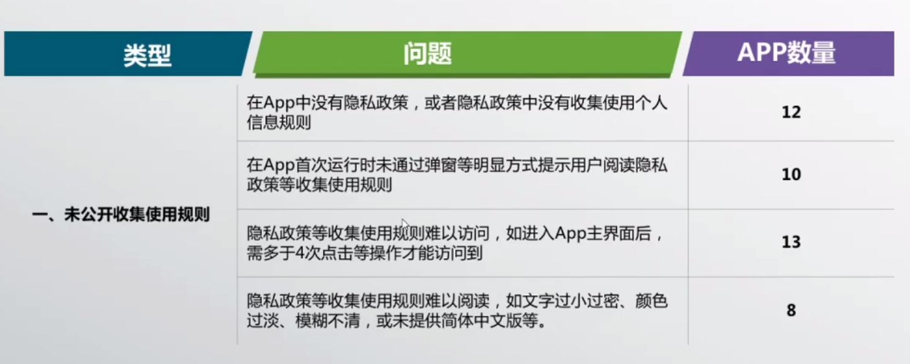
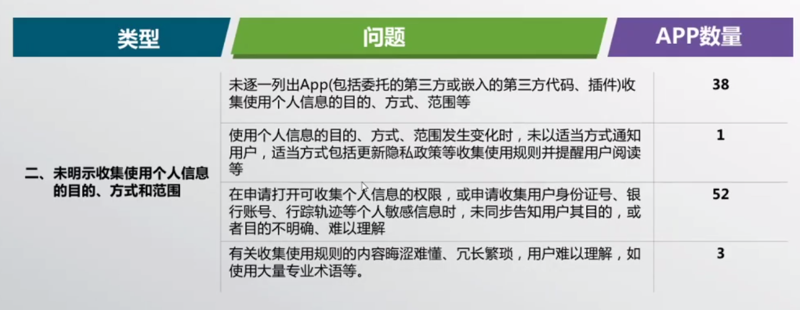
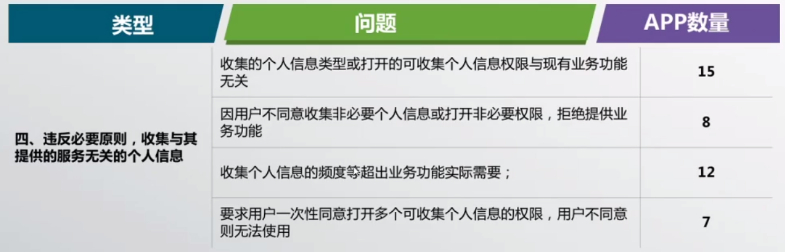
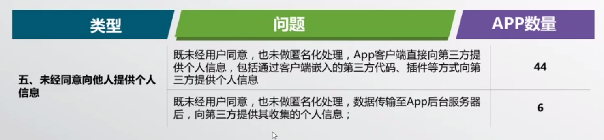
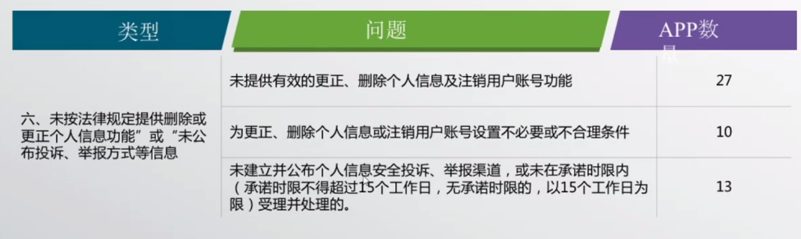

# 信息安全法律法规

## 一、法律法規责任庞杂

1. 民典法

矛盾：

个人信息保护    <----->   数据产业发展

1. 法律责任：

   民事责任 ： 赔款、侵权

   行政责任 ： 处罚下架、无法更新

   刑事责任： 爬虫等  罚金、坐牢

   

2. 责任越来越明确：

   非法收集个人信息的民事责任：立即停止并删除相关信息。

   补救信息。

   数据链条长，发生数据侵权事件，怎么承担责任？

   无法证明明确的责任方，将会出现连带责任。+==> 正在立法中  

   

3. 监管方：

   个人诉讼和公益诉讼的监管。

4. 近期出台的法律 

   《个人金融信息保护技术规范》、《信息安全技术个人信息安全规范》、《个人健康信息数据规范》等

国家大法

--> 部门小法 

--> * 国标、行标  (最重要的影响因素)

## 二、具体内容

### 2.1 告知同意

   1. 告知目的、明示同意

   2. 不得强制、不得误导

   3. 部分信息不用告知入：

      法定义务、国家安全、司法、生命财产安全等

      

### 2.2 个人生物信息

1. 生物信息不能随意采集
2. 不能随意存储和交换

### 2.3 汇聚融合

​	 是否改变了用户原授权的用途？--->否则   会有数据风险

​     数据提供方和提供方： 使用最小化原则，不能超范围处理。

-----《个人信息安全》 7.3 、7.6

### 2.4 用户画像、个性化展示

大数据杀熟等反面案例

### 2.5 用户权利保障

1. 查询
2. 更正
3. 删除
4. 撤销授权
5. 注销账户
6. 获取个人信息副本
7. 投诉

### 2.6 委托处理、共享转让、共同控制、第三方介入合规

1. 不超出范围

## 三、处理方向

内部管理制度：

# APP治理

## 一、背景

互联网发展和移动设备飞快普及。APP占用  80% 的网络使用时间。

信息安全整体问题突出：

​	  数据安全50以上存在5个以上信息安全问题

主要存在的问题：

## 二、 环节问题出现分布

1. 尽量仅在内存中存储用户信息，且进行加密。
2. 跳转第三方应用要进行提醒

## 三、主要问题

私自收集个人信息

过度索取权限

账号注销难

私自共享给第三方

不给权限不让用

强制用户使用定向推送功能

### 问题明细

​                                                                                                                               图片源于张正忠分享

# 移动应用数据安全管理

中国信通院 -- 崔伟男

## 一、现状

网信办、工信部等多部门颁布相关管理规定，从准入管理、资源管理、行为管理三方面加强移动APP监管。推动行业健康有序发展，信通院做了很多工作，从管理层到实施数据始终在人的操控下进行，提高数据操控者素质和建立整体可控、可查、可防御的数据制度安全体系。

## 二、数据安全管理原则

1.  坚持保障数据安全与发展并重
2. 鼓励研发数据安全保护技术
3. 积极推进数据资源开发利用
4. 保障数据依法有序自由流动

