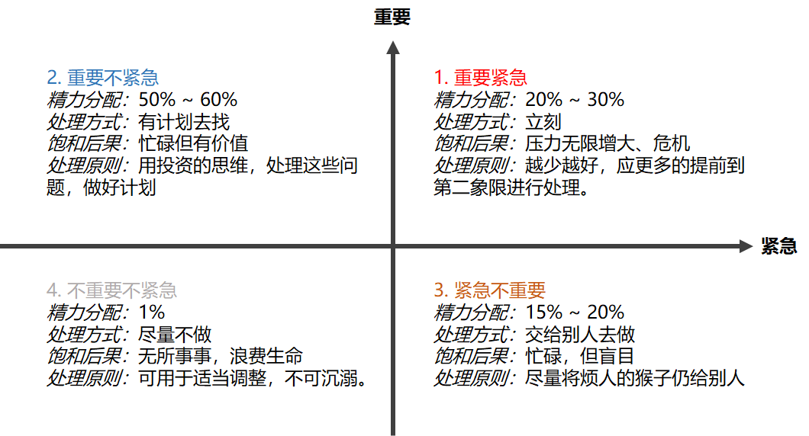

> 生活工作中总会被各种事情占满，事情永远做不完，开会，沟通问题，解决Bug...   
>
> 哪里不对？总觉得少了些什么？投入了很多时间，工资没增长，能力没有增长，见识没增长。那么我投入的时间产出了什么？明明他跟我做的工作没什么差别，为什么他会更出色，各种场景游刃有余。
>
> 如果你也是这种状态，那么你缺乏的是时间管理。

## 为什么进行时间管理？

感觉自己总有做不完的事情，为什么？

总有做不完的事，吐不完的怨气，减不完的肥，这就叫生活。

事情总是在那里不停增加，而你的时间总就那么多，这就是最深的矛盾，做事情是需要有时间损耗的，然而时间和需要做的事情不成比例。

所有需要管理时间，增加产出。

千万年来时间是我们所无法掌控的，事如流水，生命如梦靥。弹指间，多少尘埃飞满天，漫卷无边慨叹...

**既然如此那还怎么管理时间？？**

> 是拿小本本记录时间占用？？

> 制作待办事情备忘录？?

很多人错吧手段当目的。

这都不是管理时间。

### 管理时间就是管理事情

时间管理的本质是事情的管理，这有两个努力方向，其一，提高做事情的效率；其二，选择对自己更有价值的事情，提高投入产出比。两个方向分别从不同的维度进行时间管理，针对的自然是不同类型的事情，对于有些必须要做的事情，我们可以考虑第一种方案，这里会对应很多应对的方法策略，后面我们会有额外章节进行展开说明。对于有选择性的事情，要思考如何能让产出更大？？

在弄清楚这个问题之前，还需要思考什么？什么对我意义更大？

## 管理时间的三条策略

三条时间管理的策略，`割舍`、`替换`、`压缩`。

第一`割舍`，对现有行动措施进行盘点，舍去无益事项；第二`替换`，如果新增行动措施仍无法实施，则使用表示紧急性重要性的时间管理矩阵图对事项进行比较并替换；第三`压缩`，如果新增行动措施仍无法实施，则需要重点审视日常业务已压缩时间。

似乎很精辟，重点来了，我们如何进行割舍替换和压缩？

`压缩`的操作性较强，尽可能压缩归类到一起，减少过程损耗，比如邮件统一收，沟通固定时间段，将零散的事情变成时间块，进而提高处理效率。

然而`割舍`两字太精辟，当今社会选择多，B站抖音AcFun，吃鸡王者Mword。取谁舍谁很有争议？怎么替换？怎么划分优先级？似乎没太多指导意义？

## 时间管理策略的更深层次思考

### 待解决问题描述

怎么割舍和替换？

怎么确定事情的优先级？

如何制定有效计划？

有效计划的特征有哪些？

### 如何对事情进行割舍和替换？

著名的二八法则告诉我们，我们生活中大部分（80%）是不重要的，只有少数（20%）比较重要。挑出这20%的内容显得格外重要，有个比较好的方式称作时间管理的四象限法则。

顾名思义就是将我们日常的事情按照重要程度和紧迫程度划分了四个象限。分别对应的是不重要不紧急、紧急不重要、 重要不紧急以及重要紧急。

这么划分之后，如何割舍和替换的操作方式就很明确了。

* 应将大部分时间尽量放在重要的事情上，尽量割舍掉不重要的事情。
* 将工作的中心尽量替换为重要不紧急的事情上面，对不重要的事情尽量替换为重要事情。

事情的优先级有就由此划分出来： 依次是   1. 重要紧急 > 2. 重要不紧急 > 3. 紧急不重要 > 4. 不重要不紧急 

### 怎么区分哪些事情是重要的呢？

像理财一样，我们要有投资的眼光分析问题。如果一个事情，长期来看是对自身有极大好处的，那么久可以定义为重要的。

有效目标的五要素 SMART

计划怎么被有效执行？

## 时间管理的本质是自我管理

### 自我管理的有效实行措施？

### 如何打破自我惰性？

### 如何养成良好习惯？

### 自我管理作战方案ABC

