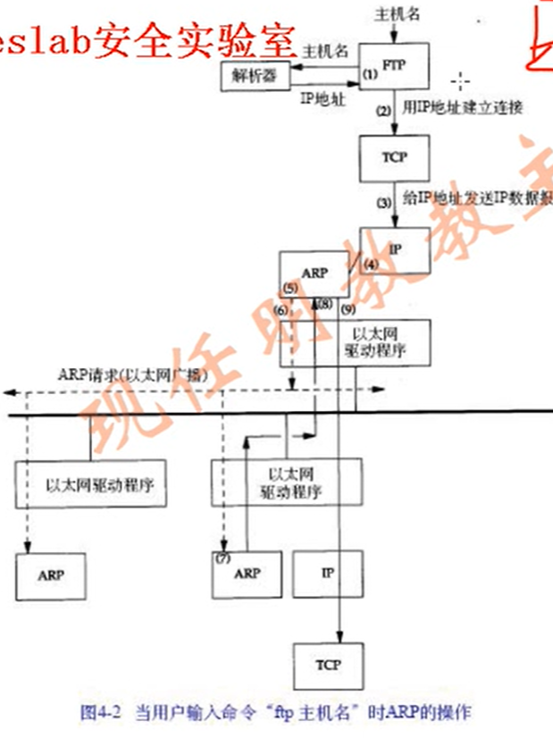
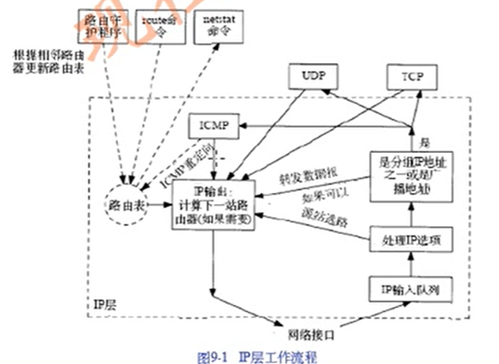

##  ARP 

IP ---> mac地址

知道主机IP并不能发送数据给主机，必须知道目标主机的MAC地址。ARP功能是在32Bit的IP地址和不同网络技术硬件地址之间的动态映射。

ARP特性： 指数退避，2 --4 -- 8，没收到回应还会重试，但会指数退避。 

### ARP 应用举例

### FTP请求步骤

1.  域名--> IP    根据域名向解析器请求IP地址。
2. 要求TPC建立连接，TCP封包到IP，IP查路由表，判断直连非直连。
3. 直连和非直连 分别 使用ARP 去解析，目标端和网关的MAC地址。发生ARP广播  地址全是 1. 48位（ff.ff.ff.ff.ff.ff）二层广播。
4. 收到ARP广播，发现自己IP地址是请求地址，发送二层单播包（包含了原主机和目地主机的MAC地址）
5. 源主机开始向目标主机发包

## RARP  

mac地址 -->  IP

## ICMP

IP的附属协议，ping工具使用，测试网络，反应网络状态。在IP内部发送。

|IP头部  | ICMP报文  \   

报文类型： 

1. 差错报文。可达状态、原因主机不可达、端口不可达等等
2. 查询状态

包含内容：标识号（进程ID）、序号（编号 顺序 + 1），数据，

发送包出现了丢失：

IP头部+UDP 前面8个字节发送回去。（8个字节中包含了端口号）

### ICMP 不产生ICMP差错报文情况。

1. ICMP 产出报文出差错，不会回复
2. 目标地址是广播
3. 不是IP分片的第一片，不包含包信息，发回去也无法处理
4. 源地址不是单个主机的数据报文，0， 环回口

原因： 防止ICMP差错报文对广播分组响应产生广播风暴。

TCP/IP 在内核中默认实现了Ping服务。

## IP 选路

IP和路由收发流程

