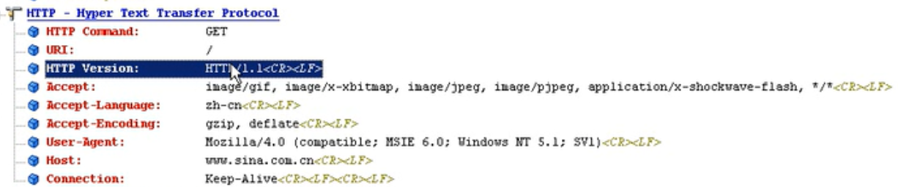

## HTTP

1. C/S 架构的 超文本传输协议
2. 是一个哑服务器，只有发命令的时候才会返回。
3. 是一个瞬时协议，TCP 通道不会保持。

HTTP组成

https://www.baidu.com/s?ie=UTF-8&wd=bili

Protocol  + Host + URI

HTTP Request:

Accept : 支持的文件格式

Accept-Encoding： 压缩方式

Host : 请求地址

URI： 地址

HTTP Command： GET  请求方式

HTTP Version ： HTTP /1.1

User-Agent： 浏览器

Base64 编码

### HTTP 请求步骤

1. 进行域名解析拿到目标主机IP地址
2. HTTP请求建立TCP连接
3. TCP 封包到IP报文
4. IP查询路由表，ARP请求目标主机或路由的MAC地址
5. ARP发送广播，并由目标主机收到广播后回复
6. 拿到源目MAC地址后可以发包建立TCP连接
7. 首先源主机发送SYN+seq=X连接请求，主机收到后将seq序列号+1，并返回ACK=X+1，req=Y，源主机收到后回复ACK=Y+1.建立TCP连接。
8. 发送HTTP请求命令
9. 断开连接则需要进行4次挥手

